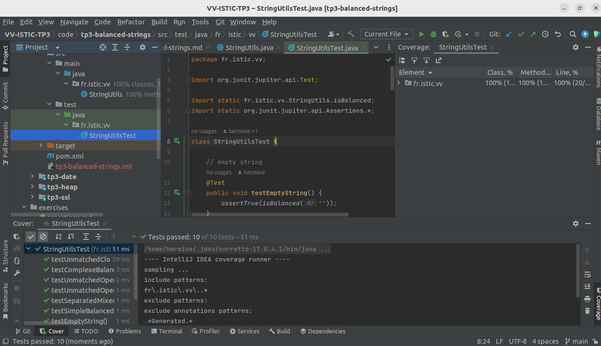

# Balanced strings

A string containing grouping symbols `{}[]()` is said to be balanced if every open symbol `{[(` has a matching closed symbol `]}` and the substrings before, after and between each pair of symbols is also balanced. The empty string is considered as balanced.

For example: `{[][]}({})` is balanced, while `][`, `([)]`, `{`, `{(}{}` are not.

Implement the following method:

```java
public static boolean isBalanced(String str) {
    ...
}
```

`isBalanced` returns `true` if `str` is balanced according to the rules explained above. Otherwise, it returns `false`.

Use the coverage criteria studied in classes as follows:

1. Use input space partitioning to design an initial set of inputs. Explain below the characteristics and partition blocks you identified.
2. Evaluate the statement coverage of the test cases designed in the previous step. If needed, add new test cases to increase the coverage. Describe below what you did in this step.
3. If you have in your code any predicate that uses more than two boolean operators check if the test cases written so far satisfy *Base Choice Coverage*. If needed add new test cases. Describe below how you evaluated the logic coverage and the new test cases you added.
4. Use PIT to evaluate the test suite you have so far. Describe below the mutation score and the live mutants. Add new test cases or refactor the existing ones to achieve a high mutation score.

Write below the actions you took on each step and the results you obtained.
Use the project in [tp3-balanced-strings](../code/tp3-balanced-strings) to complete this exercise.

## Answer
HAMONO Hermine et ROY Raphaël

2. Notre coverage est de 100% au premier essai. Nous n'avons donc pas rajouté de tests.

3. Voici ci dessous les tests ajoutés.
```
    //Base Choice Coverage for the implementation line return curlyBraces == 0 && squareBrackets == 0 && parentheses == 0;
    // 0 0 0
    @Test
    public void ooo() {
        assertTrue(isBalanced("(([{}]))"));
    }
    // x 0 0
    @Test
    public void xoo() {
        assertFalse(isBalanced("({}[]"));
    }
    @Test
    public void oxo() {
        assertFalse(isBalanced("()[{}"));
    }
    // x 0 0
    @Test
    public void oox() {
        assertFalse(isBalanced("()[]{"));
    }
    @Test
    public void xxo() {
        assertFalse(isBalanced("([{}"));
    }
    @Test
    public void oxx() {
        assertFalse(isBalanced("(){["));
    }
    // x 0 0
    @Test
    public void xox() {
        assertFalse(isBalanced("({[]"));
    }
    @Test
    public void xxx() {
        assertFalse(isBalanced("({["));
    }
```
Nous pensons que le coverage est amélioré grâce à ces tests même si certains sont sans doute redondants avec de précédents tests.
En effet nous avons pris en compte le cas ou il y a 0 d'un symbole et x d'un autre et toutes les combinaisons possible entre ceux là.
Nous avons pris x = 1 comme cas représentatif.
4. 
Nous avons tuer tout les mutants ce qui augmente notre confiance en notre code.